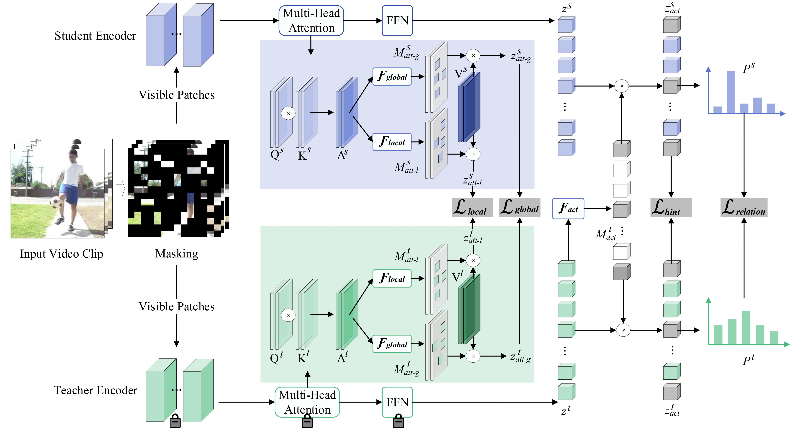

# Official PyTorch Implementation of Mask Again: Masked Knowledge Distillation for Masked Video Modeling (ACM MM 2023).



> [**Mask Again: Masked Knowledge Distillation for Masked Video Modeling**](https://dl.acm.org/doi/10.1145/3581783.3612129)<br>
> [Xiaojie Li](https://github.com/xiaojieli0903)^1,2, Shaowei He^1, [Jianlong Wu](https://jlwu1992.github.io)^1*, [Yue Yu](https://yuyue.github.io)^2, [Liqiang Nie](https://liqiangnie.github.io)^1*, [Min Zhang](https://zhangminsuda.github.io)^1<br>
> ^1Harbin Institute of Technology, Shenzhen, ^2Peng Cheng Laboratory
> *Corresponding Author


## 🚀 Main Results

### ✨ Kinetics-400

|  Method  | Extra Data | Backbone | Resolution | #Frames x Clips x Crops | Top-1 | Top-5 |
| :------: | :--------: | :------: | :--------: | :---------------------: | :---: | :---: |
| VideoMAE |  ***no***  |  ViT-S   |  224x224   |         16x5x3          | 78.7  | 93.6  |
| VideoMAE |  ***no***  |  ViT-B   |  224x224   |         16x5x3          | 81.0  | 94.6  |


### ✨ UCF101 & HMDB51

|  Method  |  Extra Data  | Backbone | UCF101 | HMDB51 |
| :------: | :----------: | :------: | :----: | :----: |
| VideoMAE | Kinetics-400 |  ViT-S   |  92.9  |  72.0  |
| VideoMAE | Kinetics-400 |  ViT-B   |  96.2  |  77.1 |

## 🔨 Installation

Please follow the instructions in [INSTALL.md](INSTALL.md).

## 📍Model Zoo

We provide pre-trained and fine-tuned models in [MODEL_ZOO.md](MODEL_ZOO.md).

## 👀 Visualization

We provide the script for visualization in [`vis_kd.sh`](scripts/vis_kd.sh).


## ✏️ Citation

If you find this project useful for your research, please considering leaving a star⭐️ and citing our paper:

```
@inproceedings{li2023mask,
  title={Mask Again: Masked Knowledge Distillation for Masked Video Modeling},
  author={Li, Xiaojie and He, Shaowei and Wu, Jianlong and Yu, Yue and Nie, Liqiang and Zhang, Min},
  booktitle={Proceedings of the 31st ACM International Conference on Multimedia},
  pages={2221--2232},
  year={2023}
}
```

## 🔒 License

This project is made available under the [Apache 2.0 license](LICENSE).

## 👍 Acknowledgements

This project is built upon [VideoMAE](https://github.com/MCG-NJU/VideoMAE.git). Thanks to the contributors of this great codebase.
